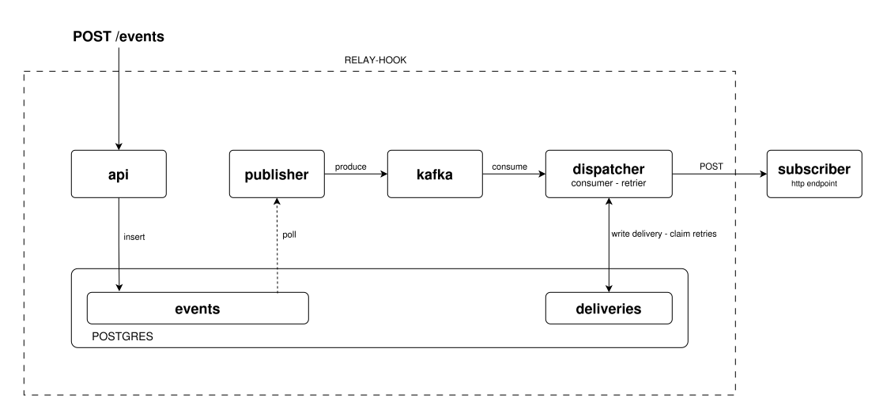

# relay-hook

A webhook delivery service written in Go. Producers POST events to an HTTP API,
subscribers register the URLs they want those events on, and relay-hook keeps
trying until each one lands.

## Running it

Everything runs from Docker Compose. Configuration comes from a `.env` file at
the repo root:

```
DB_HOST=localhost:5432
DB_DATABASE=relayhook
DB_USERNAME=user
DB_PASSWORD=password

KAFKA_BROKERS=localhost:29092
KAFKA_TOPIC=event

HTTP_ADDRESS=:8000

JWT_SECRET=changeme
```

Then:

```bash
docker compose up
```

That brings up the three relay-hook processes, Postgres, Kafka, and the
observability stack. The `migrate` service runs the migrations against Postgres
and exits. Grafana ends up on `:3000`, Kafka UI on `:8080`, the API on `:8000`.

The same `.env` is read by the binaries themselves, so you can also run one of
them outside Docker.

```bash
go run ./cmd/api
go run ./cmd/publisher
go run ./cmd/dispatcher
```

### End to end

Register a user and log in. The token is a JWT and lasts an hour.

```bash
curl -X POST localhost:8000/users/register \
  -d '{"username":"acme","password":"hunter2"}'

TOKEN=$(curl -sX POST localhost:8000/users/login \
  -d '{"username":"acme","password":"hunter2"}' | jq -r .token)
```

The JWT only manages API keys. Everything else is done with a key, and keys come
in two roles: `emitter` keys send events, `subscriber` keys register endpoints.
`event_types` scopes the key; leave it empty and the key is allowed everything.

```bash
EMIT=$(curl -sX POST localhost:8000/keys -H "Authorization: Bearer $TOKEN" \
  -d '{"role":"emitter","event_types":["order.created"]}' | jq -r .plaintext_key)

SUB=$(curl -sX POST localhost:8000/keys -H "Authorization: Bearer $TOKEN" \
  -d '{"role":"subscriber"}' | jq -r .plaintext_key)
```

Point a subscription at an endpoint, then send an event:

```bash
curl -X POST localhost:8000/subscriptions -H "X-API-KEY: $SUB" \
  -d '{"event_type":"order.created","endpoint_url":"https://example.com/hook"}'

curl -X POST localhost:8000/events -H "X-API-KEY: $EMIT" \
  -d '{"type":"order.created","payload":{"order_id":"A-1"}}'
```

Within a couple of seconds `https://example.com/hook` gets a POST with
`{"order_id":"A-1"}` as the body. The dispatcher container has
`host.docker.internal` mapped, so a listener on your own machine works as an
endpoint while you're testing.

## API

Every user's events, keys and subscribers are scoped to that user, so a key only
ever reaches its owner's data.

| Method | Path | Auth | Result |
| --- | --- | --- | --- |
| `POST` | `/users/register` | — | `200` with the new user |
| `POST` | `/users/login` | — | `200` with `{"token": "..."}` |
| `POST` | `/keys` | JWT | `200` with the key and its plaintext, shown once |
| `GET` | `/keys` | JWT | `200` with the user's keys, hashes omitted |
| `DELETE` | `/keys/{id}` | JWT | `204` |
| `POST` | `/events` | emitter key | `202` with the stored event |
| `GET` | `/events` | emitter key | `200` with every event the user has sent |
| `POST` | `/subscriptions` | subscriber key | `200` with the subscription |
| `GET` | `/subscriptions` | subscriber key | `200` with subscriptions and their endpoints |
| `DELETE` | `/subscriptions/{id}` | subscriber key | `204` |
| `PUT` | `/subscribers/{id}` | subscriber key | `200`; moves the endpoint URL |
| `DELETE` | `/subscribers/{id}` | subscriber key | `204`; takes its subscriptions with it |

JWTs go in `Authorization: Bearer`, API keys in `X-API-KEY`. Keys carry their
role in the prefix (`rh_emit_`, `rh_sub_`) and expire after seven days.

An event payload is arbitrary JSON, stored as `jsonb` and forwarded to the
subscriber untouched. A subscriber is a URL; a subscription is a URL paired with
one event type. Registering the same URL twice reuses the subscriber and just
adds the second subscription to it.

## How it works

Three processes, one Postgres, one Kafka topic.

<picture>
  <source media="(prefers-color-scheme: dark)" srcset="docs/architecture-dark.svg">
  
</picture>

### The outbox

Events land in the `events` table with `status = 'pending'`. The publisher wakes
up every two seconds, opens a transaction, reads whatever is still pending,
produces each one to Kafka, flips its status to `published`, and commits.

If the publisher dies halfway through, the transaction rolls back and those
events are still pending on the next tick. Nothing is dropped. The cost is
duplicates.

### Deliveries

The dispatcher consumes the topic, and for each event asks which subscribers
want that `(user_id, event_type)` pair. Every match gets a row in `deliveries`
holding the payload, the target URL, a status and an attempt count. Then it
POSTs, with a 10-second client timeout, and writes the result back:

- **delivered** — the endpoint answered 2xx.
- **failed** — it didn't, and there are attempts left.
- **dead** — it didn't, and the attempt count is past 5. Nothing retries a dead
  delivery.

The delivery's own ID goes out as an `Idempotency-Key` header. Since the
pipeline is at-least-once from end to end, a subscriber will occasionally see
the same body twice, and that header is how it can tell.

### Retries

The retrier runs every five minutes and takes a batch of up to fifty deliveries.
A single statement marks the rows `processing`, bumps their attempt count,
stamps them with the current time and hands them back.

Two kinds of rows qualify:

- Anything sitting in `failed`, where the endpoint answered badly and there are
  attempts left.
- Anything sitting in `processing` with a claim stamp older than ten minutes,
  which belonged to a worker that died mid-flight.

If a delivery gets through five retries without succeeding, the endpoint is
treated as down and the delivery is marked dead.

## Not done yet

- HMAC signatures on outgoing requests.
- Tests.
